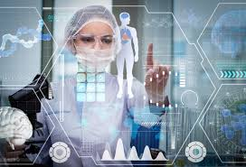
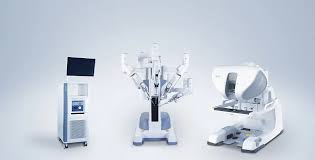

# Netflix_insights

Welcome to the "AI - Netflix insights" project.

## Introduction

Artificial Intelligence (AI) has emerged as a transformative force reshaping industries and societies since its inception. From its early conceptualization as a pursuit of replicating human cognitive abilities to its modern-day application across diverse domains, the journey of AI reflects a relentless pursuit of innovation and advancement.  

Since its nascent stages in the mid-20th century, AI has undergone significant evolution, propelled by breakthroughs in computer science, mathematics, and cognitive psychology. The foundational work of pioneers such as Alan Turing, John McCarthy, and Marvin Minsky laid the groundwork for exploring the potential of algorithms to exhibit intelligent behavior.  

In our current project, we delve into the fundamental concepts of artificial intelligence (AI), including machine learning, data preprocessing, and descriptive data analysis.  

Moreover, our project entails practical hands-on experience with Python's powerful data manipulation library, pandas.  

## 1. AI Watch

### Artificial Intelligence

AI is the simulation of human intelligence in machines that are programmed to think and act like humans. Learning, reasoning, problem-solving, perception, and language comprehension are all examples of cognitive abilities.  

AI is a method of making a computer, a computer-controlled robot, or a software think intelligently like the human mind. AI is accomplished by studying the patterns of the human brain and by analyzing the cognitive process. The outcome of these studies develops intelligent software and systems.  

### Machine Learning

Machine learning is a subfield of AI that uses algorithms trained on data sets to create models that enable machines to perform tasks that would otherwise only be possible for humans, such as categorizing images, analyzing data, or predicting price fluctuations.  

Today, machine learning is one of the most common forms of AI and often powers many of the digital goods and services we use every day.  

### Data preprocessing

Data preprocessing transforms the data into a format that is more easily and effectively processed in data mining, machine learning and other data science tasks. The techniques are generally used at the earliest stages of the machine learning and AI development pipeline to ensure accurate results.  

There are several different tools and methods used for preprocessing data, including the following:  

- sampling, which selects a representative subset from a large population of data;  
- transformation, which manipulates raw data to produce a single input;  
- denoising, which removes noise from data;  
- imputation, which synthesizes statistically relevant data for missing values;  
- normalization, which organizes data for more efficient access;  
- feature extraction, which pulls out a relevant feature subset that is significant in a particular context.

### Descriptive Data Analysis

Data analytics can be broken into four key types:  

- *Descriptive*, which answers the question, “What happened?”  
- Diagnostic, which answers the question, “Why did this happen?”  
- Predictive, which answers the question, “What might happen in the future?”  
- Prescriptive, which answers the question, “What should we do next?”  

Descriptive analysis is an important phase in data exploration that involves summarizing and describing the primary properties of a dataset. It provides vital insights into the data’s frequency distribution, central tendency, dispersion, and identifying position.  

Descriptive analytics is especially useful for communicating change over time and uses trends as a springboard for further analysis to drive decision-making.

### Applications of AI in Healthcare

❤️ Diagnosis and Prediction

AI-based systems can assist in diagnosing diseases from medical images, genetic data, or other biometric inputs with accuracy sometimes surpassing that of humans. Examples include early detection of diseases such as cancer or cardiovascular conditions.

❤️ Treatment Personalization

AI enables a more personalized approach to medicine by tailoring treatments based on individual patient data. This can enhance treatment effectiveness and minimize side effects.

❤️ Hospital Resource Optimization

AI systems can predict high-demand periods for healthcare services, aid in managing medication stocks, and optimize staff schedules and equipment utilization.

❤️ Drug Development

AI accelerates drug discovery by predicting the efficacy of candidate molecules much faster than traditional methods.

❤️ Surgical Robots

AI-assisted robots can perform surgeries with precision and consistency often superior to human surgeons, reducing risks and improving recovery times.

❤️ Remote Continuous Monitoring

Thanks to AI, continuous remote health monitoring is possible. This allows for swift intervention in case of health deterioration, particularly beneficial for chronic or convalescent patients.

Conclusion

In summary, integrating artificial intelligence into healthcare has the potential not only to enhance the quality and accessibility of care but also to significantly reduce costs while providing more personalized and effective solutions for patients.

## 2. Netflix

<Link to the Jupyter Notebook>

## Conclusion

## Sources

<https://www.techtarget.com/searchdatamanagement/definition/data-preprocessing>  
<https://www.questionpro.com/blog/descriptive-analysis/#:~:text=Descriptive%20analysis%20is%20an%20important,%2C%20dispersion%2C%20and%20identifying%20position>.  
<https://online.hbs.edu/blog/post/descriptive-analytics>  
<https://www.coursera.org/articles/what-is-machine-learning?utm_medium=sem&utm_source=gg&utm_campaign=B2C_EMEA_google-cybersecurity_google_FTCOF_professional-certificates_country-multi-pmax-braze-ftp-180d_coursera-non-mdf&campaignid=20858198818&adgroupid=&device=c&keyword=&matchtype=&network=x&devicemodel=&adposition=&creativeid=&hide_mobile_promo&gad_source=1&gclid=CjwKCAjwoPOwBhAeEiwAJuXRhxEnKsg8IaHlMhCw8i97i-YP_Et14aF9RlvkoFyDHHz8_Qmj_gUEhRoC91kQAvD_BwE>  
<https://www.simplilearn.com/tutorials/artificial-intelligence-tutorial/what-is-artificial-intelligence>
